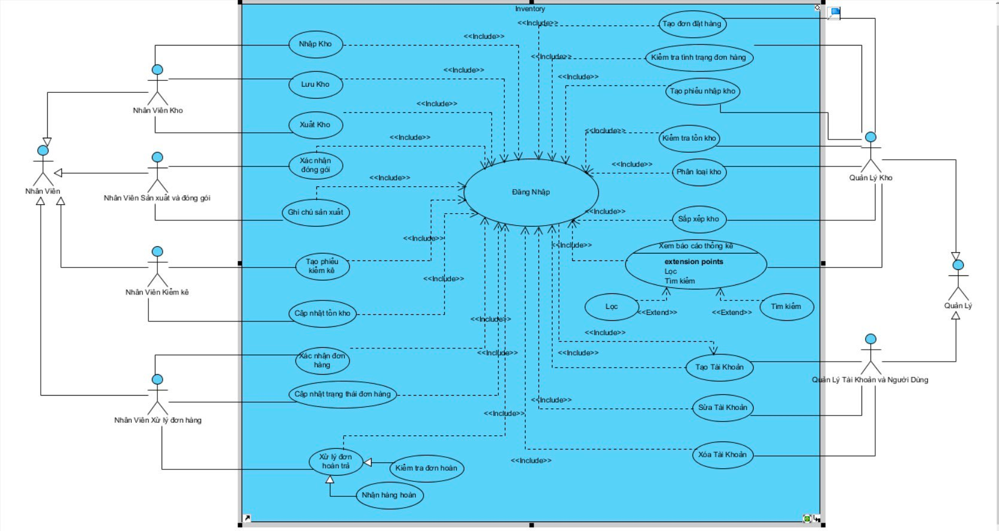

# Reset Db
```PHP
php artisan db:drop --force
```
# Chú thích table
- ProductVariants: Chứa các phiên bản sản phẩm, ví dụ như iPhone 12 Red 64GB có một giá riêng và tồn kho riêng.
- VariantAttributes: Liên kết giữa phiên bản sản phẩm và giá trị thuộc tính, giúp bạn xác định tổ hợp của các thuộc tính cụ thể cho từng phiên bản sản phẩm.
- products: Chứa thông tin cơ bản của sản phẩm.
- attributes: Chứa các loại thuộc tính như "Color", "Size".
- attribute_values: Chứa các giá trị cụ thể của thuộc tính như "Red", "Blue", "X", "XL".
- product_variants: Chứa thông tin về các tổ hợp thuộc tính khác nhau của một sản phẩm cụ thể, bao gồm giá và tồn kho.
- variant_attributes: Liên kết giữa các product_variants và attribute_values để chỉ định tổ hợp thuộc tính.
- users : thông tin tài khoản
- user_types : Các type của tài khoản
- user_has_types : Liên kết nhiều nhiều , 1 user nhiều user_type
